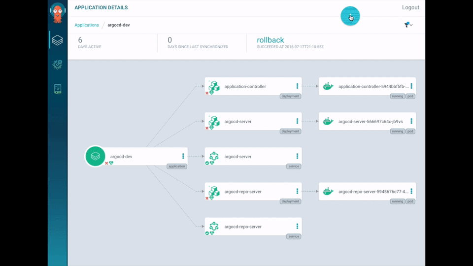
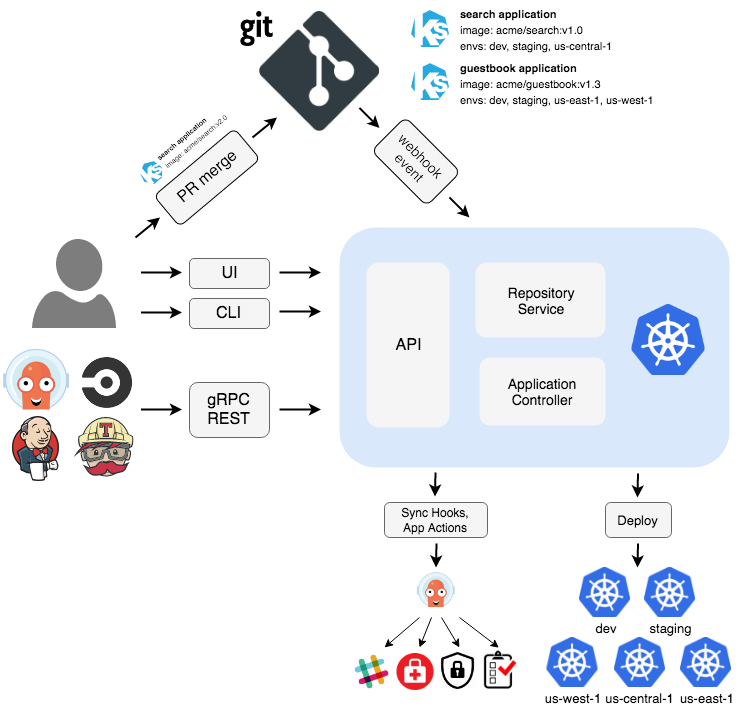

# 概述

<!-- markdownlint-disable MD026 -->
## 什么是 Argo CD ？
<!-- markdownlint-enable MD026 -->

Argo CD 是一个为 Kubernetes 而生的，遵循声明式 GitOps 理念的持续部署（CD）工具。



<!-- markdownlint-disable MD026 -->
## 为什么选 Argo CD ？
<!-- markdownlint-enable MD026 -->

应用定义、配置和环境信息是声明式的，并可以进行版本控制。
应用部署和生命周期管理是全自动化的、是可审计的，清晰易懂。

## 入门指南

### 快速开始

```bash
kubectl create namespace argocd
kubectl apply -n argocd -f https://raw.githubusercontent.com/argoproj/argo-cd/stable/manifests/install.yaml
```

请遵循我们的[入门指南](getting_started.md)。提供了更多有关其他功能的面向用户的[文档](user-guide/)。
如果您要升级 ArgoCD，请参阅[升级指南](./operator-manual/upgrading/overview.md)。面向开发人员的[文档](developer-guide/)可供有兴趣构建第三方集成的人员使用。

## 它是如何工作的

Argo CD 遵循 **GitOps** 模式，该模式使用 Git 存储库作为定义所需应用程序状态的真实来源。Kubernetes 清单可以通过几种方式指定：

* [kustomize](https://kustomize.io) applications 资源清单
* [helm](https://helm.sh) charts 资源清单
* [ksonnet](https://ksonnet.io) applications 资源清单
* [jsonnet](https://jsonnet.org) files 资源清单
* YAML/json 资源清单的简单目录
* 任何配置为配置管理插件的自定义配置管理工具

Argo CD 可在指定的目标环境中自动部署所需的应用程序状态。
应用程序部署可以在 Git 提交时跟踪对分支，标签的更新，或固定到清单的特定版本。
有关可用的不同跟踪策略的更多详细信息，请参阅[跟踪策略](user-guide/tracking_strategies.md)。

10分钟速览 Argo CD，请查看展示给 Sig Apps 社区会议的 Demo：

[](https://youtu.be/aWDIQMbp1cc?t=1m4s)

## 架构



Argo CD 被实现为 kubernetes 控制器，该控制器连续监视正在运行的应用程序，
并将当前的活动状态与所需的目标状态（在 Git 存储库中指定）进行比较。
其活动状态偏离目标状态的已部署应用程序被标记为 `OutOfSync`。
Argo CD 报告 & 可视化差异，同时提供了自动或手动将实时状态同步回所需目标状态的功能。
在 Git 存储库中对所需目标状态所做的任何修改都可以自动应用并反映在指定的目标环境中。

有关更多详细信息，请参见[架构概述](operator-manual/architecture.md)。

## 功能

* 将应用程序自动部署到指定的目标环境
* 支持多种配置管理/模板工具（Kustomize、Helm、Ksonnet、Jsonnet、plain-YAML）
* 能够管理和部署到多个集群
* SSO集成（OIDC, OAuth2, LDAP, SAML 2.0, GitHub, GitLab, Microsoft, LinkedIn）
* 授权的多租户和 RBAC 策略
* 回滚/回滚到 Git 存储库中提交的任何应用程序配置
* 应用程序资源的健康状态分析
* 自动配置漂移检测和显示
* 将应用程序自动或手动同步到所需的状态
* Web UI，提供应用程序活动的实时视图
* 用于自动化和 CI 集成的 CLI
* Webhook集成（GitHub, BitBucket, GitLab）
* 用于自动化的访问令牌
* PreSync、Sync、PostSync 钩子支持复杂的应用程序发布（例如，blue/green & canary 升级）
* 应用程序事件和 API 调用的审计跟踪
* Prometheus 指标
* 在 Git 中重写 ksonnet/helm 参数的参数覆盖

## 开发状态

社区正在积极开发 Argo CD。我们的版本可以在[这里](https://github.com/argoproj/argo-cd/releases)找到。

## 已采用组织

已经正式采用 Argo CD 的组织可以在[这里](https://github.com/argoproj/argo-cd/blob/master/USERS.md)找到。
